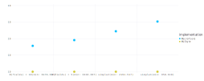
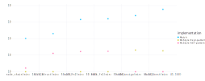
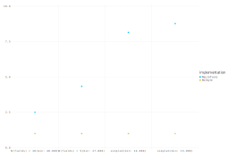
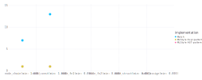

MLStyle.jl
=========================

[](https://travis-ci.org/thautwarm/MLStyle.jl)
[](https://codecov.io/gh/thautwarm/MLStyle.jl)
[](https://github.com/thautwarm/MLStyle.jl/blob/master/LICENSE)
[](https://thautwarm.github.io/MLStyle.jl/latest/)

Rich features are provided by MLStyle.jl and you can check [documents](https://thautwarm.github.io/MLStyle.jl/latest/) to get started.

For installation, open package manager mode in Julia shell and `add MLStyle`:
```
pkg> add MLStyle
```

## Benchmark

Many comparsions among distinct related Julia productions have made.

Time Overhead
---------------

In x-axis, after the name of test-case is the least time-consuming one's index, the unit is `ns`).

The y-label is the ratio of the implementation's time cost to that of the least time-consuming.

- vs MacroTools

[](./vs-macrotools-on-time.svg)

- vs Match.jl

[](./vs-match-on-time.svg)


Allocation
-----------------

In x-axis, after the name of test-case is the least allocted one's index, the unit is `bytes`).

The y-label is the ratio of  the implementation's allocation cost to that of the least allocted.

- vs MacroTools

[](./vs-macrotools-on-allocs.svg)

- vs Match.jl

[](./vs-match-on-allocs.svg)


Comparison Among Different Languages
----------------------------------------

Benchmark scripts for any other language are welcome. We're curious about the actual performance ranking of MLStyle.jl.

## Preview

In this README I'm glad to share some non-trivial code snippets.

### Homoiconic pattern matching for Julia ASTs

```julia
rmlines = @λ begin
    e :: Expr           -> Expr(e.head, filter(x -> x !== nothing, map(rmlines, e.args))...)
      :: LineNumberNode -> nothing
    a                   -> a
end
expr = quote
    struct S{T}
        a :: Int
        b :: T
    end
end |> rmlines

@match expr begin
    quote
        struct $name{$tvar}
            $f1 :: $t1
            $f2 :: $t2
        end
    end =>
    quote
        struct $name{$tvar}
            $f1 :: $t1
            $f2 :: $t2
        end
    end |> rmlines == expr
end
```

### Generalized Algebraic Data Types

 ```julia
@use GADT

@data public Exp{T} begin
    Sym       :: Symbol => Exp{A} where {A}
    Val{A}    :: A => Exp{A}
    App{A, B} :: (Exp{Fun{A, B}}, Exp{A_}) => Exp{B} where {A_ <: A}
    Lam{A, B} :: (Symbol, Exp{B}) => Exp{Fun{A, B}}
    If{A}     :: (Exp{Bool}, Exp{A}, Exp{A}) => Exp{A}
end

```

A simple intepreter implementation using GADTs could be found at `test/untyped_lam.jl`.


### Active Patterns

Currently, in MLStyle it's not a [full featured](https://docs.microsoft.com/en-us/dotnet/fsharp/language-reference/active-patterns) one, but even a subset with parametric active pattern could be super useful.

```julia
@active Re{r :: Regex}(x) begin
    match(r, x)
end

@match "123" begin
    Re{r"\d+"}(x) => x
    _ => @error ""
end # RegexMatch("123")
```
